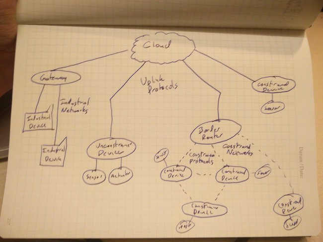

# A Whirlwind Tour of the IoT Landscape

Whew! That is a lot of moving parts! Lets break that down and explain each part from a very high level (you'll find more information about each part in the upcoming chapters)

## [Constrained Devices](./constrained.html)

These are the "Things" in the Internet of Things! They are low cost, special purpose devices, such as a thermostat, a motion sensor in a hallway, a smart light bulb, or any other number of things! In theory, they do one thing, and do it well. They are often battery powered (lasting months to years), wireless, and even considered disposable. They typically communicate using simple protocols to more powerful computers locally (in the same building), or far away (kilometers away, or up in "The Cloud"). They view and interact with the world using Sensors and Actuators.

## Sensors

Sensors are small electronic devices that convert some sort of real world measurement into an analog or digital electrical signal for a device to read. These can include Temperature Sensors, Motion Sensors, Rotation Sensors, etc. Typically, these devices have no way to communicate, and must be paired with some other device to interpret and send the data

## Actuators

If Sensors are how devices "read" the world, Actuators are how devices directly or indirectly "write" to the world. Actuators allow the devices to influence the physical world by performing tasks such as turning on a heater, opening a door, or watering a plant. This category includes electrical parts such as motors, relays, solenoids, and more. Like sensors, actuators typically have no logic or communication abilities by themselves, and must be paired with some other device.

## Constrained Networks

WiFi or Cell technologies like GSM often aren't an acceptable choice for constrained devices due to the limited range (10s of meters for WiFi, poor indoor coverage for GSM), and/or high power cost. Wireless alternatives for Wi-Fi include Personal Area Networks (PANs) such as [Bluetooth](https://en.wikipedia.org/wiki/Bluetooth), [6LoWPan](https://en.wikipedia.org/wiki/6LoWPAN), [Zigbee](https://en.wikipedia.org/wiki/ZigBee), and [Thread](https://en.wikipedia.org/wiki/Thread_(network_protocol)), or Wide Area Networks (WANs) such as [SIGFOX](https://en.wikipedia.org/wiki/Sigfox) or LoRa. PANs offer something similar to WiFi, though often with much lower power, or much longer range. PANs offer something similar to GSM, though without needing a network provider, and better coverage in hard to reach areas. Both of these network choices tend to be much lower power, but come with a major tradeoff: a huge reduction in speed and throughput.

## Constrained Protocols

Often due to a lack of processing power, or limited access to a communication network, the technologies used by phones, laptops, and desktop computers to communicate with eachother and the internet are too much for IoT devices to handle. In order to work around this, there are many specialized lightweight protocols used when communicating with constrained devices. These include protocols like [MQTT](https://en.wikipedia.org/wiki/MQTT), which allows for devices and consumers to publish and subscribe to specialized topics, and [CoAP](https://en.wikipedia.org/wiki/Constrained_Application_Protocol), which allow constrained devices to act like a webserver, in a very limited way.

## Border Routers and Gateways

In order to bridge the gap between devices using specialized Constrained Networks and Protocols, and the rest of the internet, a Border Router is typically used. Consumer border routers are now typically called "Smart Hubs", and function similarly to how a Wireless Router or Access Point behaves.

In some cases, it is necessary to allow for some logic to be kept locally, rather than making a full trip to the "Cloud". For example, if a smart temperature sensor says that a room is too cold, a smart thermostat should turn the heater on, even if the internet is down. In these cases, a Gateway which houses some kind of logic in it can be used.

In many cases, Border Routers and Gateways are within one physical device, acting as a single nexus for communication and logic.
